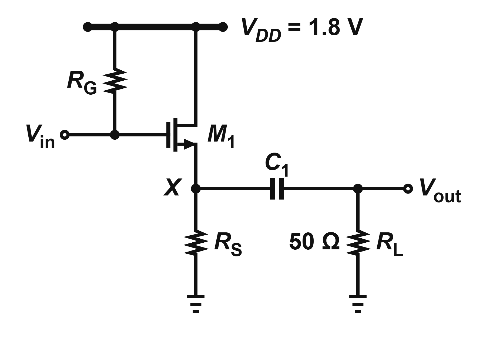

# analog-canvas-toolkit

離線產生 [Analog Canvas](https://analog-canvas.tokenzhang.com/editor) 的
`.icproj.json` 專案檔，畫出**課本級**的類比電路圖：寫一支 140 行的產生器 →
跑四道自動稽核 → 在編輯器 `File / Import Project File` 匯入。

不用滑鼠拖元件，也不靠肉眼判讀原圖——間距、標籤位置、密度都有可量的規則，
全部寫在 [`SOP.md`](SOP.md) 裡。**動手前先讀 SOP，不要憑印象畫。**


## 環境需求

| 需要 | 用途 |
|---|---|
| Python 3.8+ | 產生器與截圖掃描器（`scan_figure.py` 需要 Pillow） |
| Node.js 18+ | `validate.mjs`、`check_labels.mjs`（用網站自己的 zod schema） |
| Chrome | 把預覽 SVG 轉成 PNG 親眼看一次 |

## 首次設定（約 10 秒）

符號資產與網站 schema 都是上游 [cascode-ai/analog-canvas](https://github.com/cascode-ai/analog-canvas)
的產物，**不進版控**，clone 後自己抓：

```bash
python toolkit/fetch_symbols.py    # -> toolkit/sym/*.json（48 個符號）
python toolkit/refresh_model.py    # -> toolkit/model.mjs（網站的 schema）
```

網站改版、或匯出的專案回報不同的 `schemaVersion` 時，重跑 `refresh_model.py`。

## 畫一張圖（目標 5~10 分鐘）

```bash
python toolkit/scan_figure.py path/to/screenshot.png   # ⓪ 拓樸／鏡射／GAP／密度基準
cp toolkit/gen_fig848.py toolkit/gen_myfig.py          # ① 抄範本，只改五段資料
python toolkit/gen_myfig.py                            # ② 自檢＋走線＋標籤＋密度
node toolkit/validate.mjs out/MyFig.icproj.json        # ③ 網站 schema
node toolkit/check_labels.mjs out/MyFig.icproj.json    # ④ 標籤逐位元比對
```

第 ② 步印出的五類問題**全部要是 0** 才往下走：

| 訊息 | 意思 |
|---|---|
| `self-check errors` | 非正交、零長度、腳位不存在、junction 壓在 terminal 上 |
| `<-- LONG` | 該段超過 40 單位且不在 `long_haul` 白名單 |
| `! LABEL OVERLAPS WIRE` | 文字框壓到走線 |
| `! LABEL AMBIGUOUS` | 標籤離鄰居太近，讀者分不出屬於誰 |
| `TOO LOOSE` | 元件佔圖高的比例低於原圖的 85%，排太鬆 |

最後渲染成 PNG 親眼看一次（產生器會印出該用的 `--window-size`）。

## 範本怎麼挑

| 圖裡有什麼 | 抄這支 |
|---|---|
| opamp、電阻、接地（最乾淨的範本） | `toolkit/gen_fig848.py` |
| 電阻／電容、旋轉 90 度、數值標籤 | `toolkit/gen_fig794.py` |
| 差動對、多顆尾電流源、差動輸出埠 | `toolkit/gen_fig1035.py` |
| BJT、電源軌 | `toolkit/gen_fig5170.py` |

`gen_fig934.py` 與 `gen_fig983_cg.py` 是舊式獨立骨架，只拿來查座標寫法，**不要複製**。

## 範例

`examples/` 有 12 張，全部通過上面四道驗證。

| | |
|---|---|
|  |  |
|  |  |

## 檔案位置

見 [`SOP.md` §10](SOP.md)。`out/` 是產生器的輸出目錄，裡面的 `.icproj.json` 不進版控。

## 來源

電路圖編輯器與符號資產屬於 [cascode-ai/analog-canvas](https://github.com/cascode-ai/analog-canvas)。
本 repo 只包含自己寫的產生器、稽核規則與 SOP；上游的 `sym/*.json` 與 `model.mjs`
由 `fetch_symbols.py` / `refresh_model.py` 在本機取得，不重新散布。
