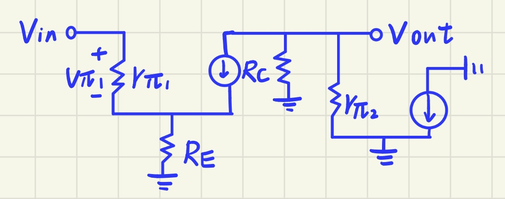
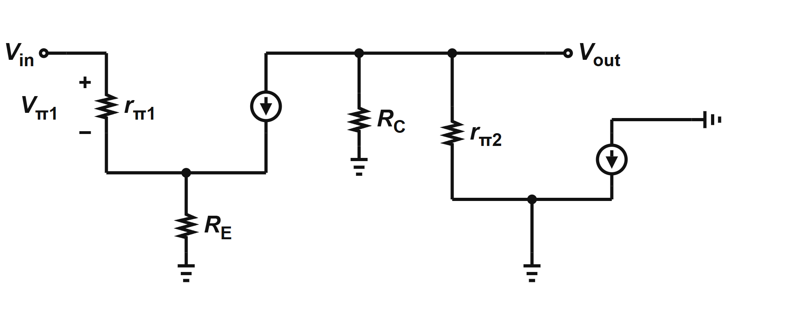
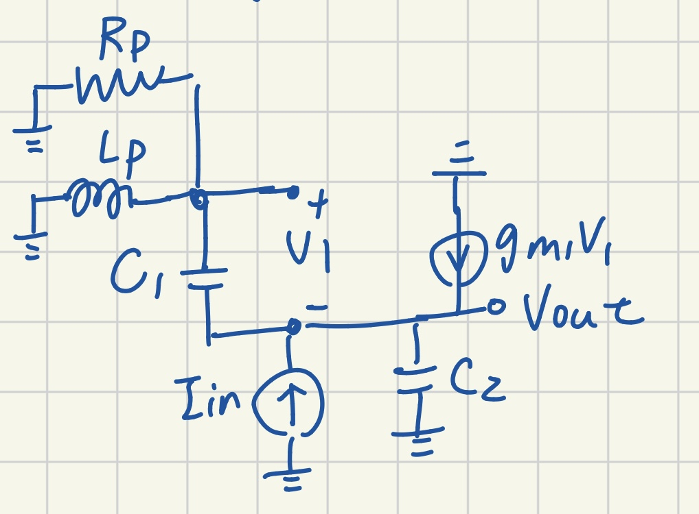
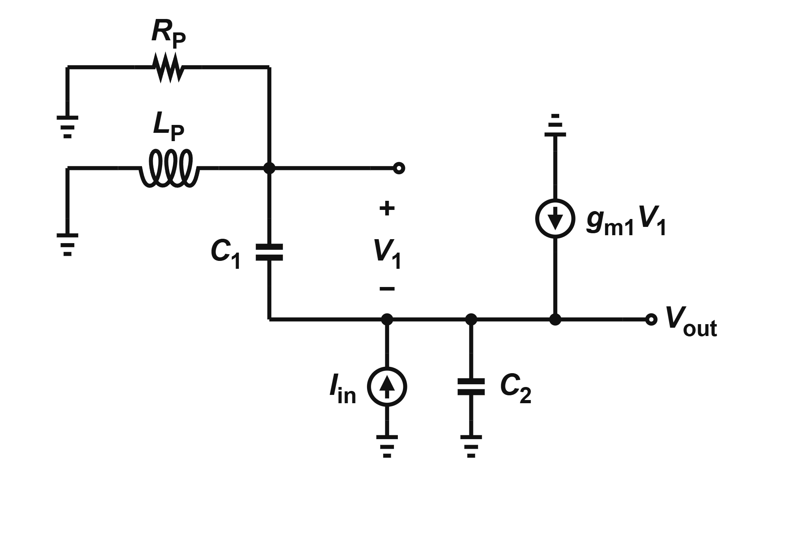
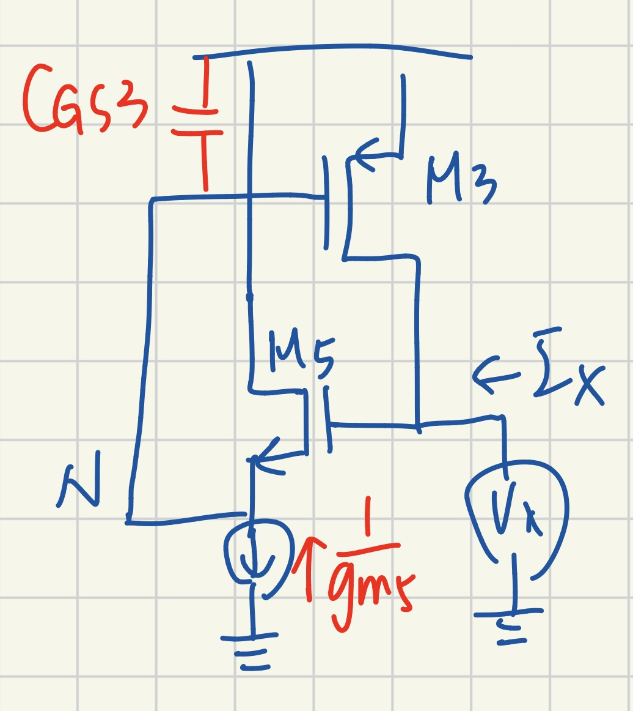
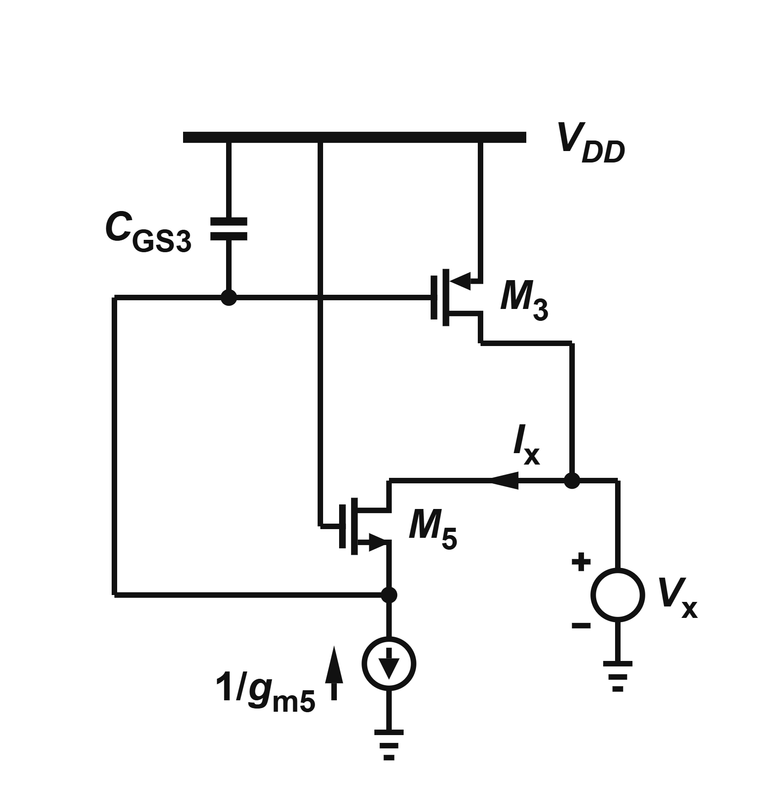

# Analog Canvas Toolkit

[](https://github.com/royal0421/analog-canvas-toolkit/actions/workflows/ci.yml)


在本機用 Python **生成、稽核、驗證與預覽** [Analog Canvas](https://analog-canvas.tokenzhang.com/editor)
的 `.icproj.json` 專案檔。它把元件位置、net、走線與標籤寫成可重現的產生器，適合繪製課本級的類比、混合訊號與電晶體級電路圖。

> 這是非官方工具，不是全自動 image-to-schematic 系統。`scan_figure.py` 能量測印刷圖的線段、鏡射與密度，但拓樸與元件種類仍需人工確認；手繪圖尤其如此。首次設定需要網路，同步完成後才是本機工作流。


## 能做什麼

- 用簡短的 Python 產生器建立 Analog Canvas 專案，不必逐顆拖拉元件。
- 自動檢查非正交／零長走線、未接腳位、跨 net 端點、重複 ID、漏 junction、線穿元件與標籤碰撞。
- 使用 Analog Canvas 正式站目前的 Zod schema 驗證輸出。
- 使用編輯器自己的 RichText builder 比對標籤格式。
- 產生 SVG 預覽；找到 Chrome／Chromium 時再產生 PNG。
- 在隔離的暫存目錄重建全部 29 個專案，確認結果有效且可重現。

目前 repo 有 **29 支 generator、29 份可匯入專案、30 張 gallery PNG**。多出的一張是歷史展示圖，沒有對應 generator；回歸基準以 29 份 `out/*.icproj.json` 為準。

## 五分鐘快速開始

### 需求

| 工具 | 版本／用途 |
|---|---|
| Python | 3.8+；產生器、工作流與圖像掃描 |
| Node.js | 18+；執行官方 schema 與標籤驗證 |
| NumPy、Pillow | `scan_figure.py` 的圖像分析 |
| Chrome／Chromium | 選用；把 SVG 預覽轉成 PNG |
| 網路 | 首次同步符號與 schema，以及上游更新時 |

Windows PowerShell：

```powershell
git clone https://github.com/royal0421/analog-canvas-toolkit.git
Set-Location analog-canvas-toolkit

py -m venv .venv
.\.venv\Scripts\Activate.ps1
python -m pip install -r requirements.txt

python -m toolkit setup
python -m toolkit doctor
python -m toolkit generate gen_fig848
```

macOS／Linux 只需把啟用虛擬環境的指令換成：

```bash
source .venv/bin/activate
```

生成成功後會得到：

- 專案檔：`out/Razavi_Fig_8_48_noninverting-T-feedback.icproj.json`
- 工作預覽：`toolkit/preview_fig848.svg`
- PNG 預覽：`toolkit/preview_fig848.png`（Chrome／Chromium可用時）

前往 Analog Canvas，選擇 **File → Import Project File**，匯入 `out/` 裡的專案檔。

## 成功輸出長什麼樣

```text
self-check errors: 0
audits: legs 0 | labels 0 | on-wire 0 | tees 0   (all must be 0)
  schema: VALID (v32)
  labels: OK (0 declared plain)
  png: preview_fig848.png (1770x895)
wrote 25151 bytes -> Razavi_Fig_8_48_noninverting-T-feedback.icproj.json
```

硬性檢查失敗時，generator 會以非零狀態結束，而且**不會覆蓋既有的已知良好成品**。新專案先寫到暫存檔，所有檢查通過後才會原子替換 `out/` 內的檔案。

| 訊息 | 檢查內容 |
|---|---|
| `self-check errors` | ID、net、腳位、route endpoint、非正交／零長走線、未接 terminal 與 junction 使用次數 |
| `legs` | 單段走線超過 40 單位，卻未明確列入 `long_haul` |
| `labels` | 標籤壓線，或離同類鄰近元件太近而可能誤讀 |
| `on-wire` | 元件靠到別條 net，或走線穿過任何元件本體 |
| `tees` | 三向接點缺少 junction，導致編輯器不畫圓點；電源軌依上游規則例外 |
| `schema` | 專案不符合目前同步的 Analog Canvas schema |
| RichText labels | 未宣告的標籤格式與編輯器 builder 不一致 |
| PNG | Chrome／Chromium 實際渲染預覽；可用 `--no-render` 明確略過 |

## 統一工作流

所有日常操作都可從一個 interface 進入：

```text
python -m toolkit doctor
python -m toolkit setup
python -m toolkit list
python -m toolkit generate gen_fig848
python -m toolkit generate all --no-render
python -m toolkit validate
python -m toolkit regress
```

| 指令 | 用途 |
|---|---|
| `doctor` | 檢查 Python、Node、NumPy、Pillow、符號、schema adapter 與 Chrome |
| `setup` | 同步上游符號（2026-09-04 為 59 個）、正式站 schema、穩定 model adapter 與 schema 版本 |
| `list` | 列出 generator 與對應輸出 |
| `generate` | 生成單張或全部專案；名稱可用 generator 或輸出檔名 |
| `validate` | 以正式站 schema 驗證指定檔案，未指定時驗證全部 `out/` |
| `regress` | 在暫存目錄平行重建全部專案、驗證並逐位元比對 tracked outputs |

仍可直接執行 `python toolkit/gen_fig848.py`。統一指令的優點是錯誤訊息、依賴檢查與退出狀態一致，也不需要記住每支輔助腳本的位置。

### 環境變數

| 變數 | 行為 |
|---|---|
| `AC_VERBOSE=1` | 印出完整走線長度表 |
| `AC_NO_RENDER=1` | 只略過 Chrome PNG；schema 與標籤仍完整驗證 |
| `AC_FAST=1` | 略過所有外部驗證與 PNG，只保留內部稽核；僅供快速除錯，不可當交付或 CI 結果 |
| `CHROME_PATH=/path/to/chrome` | 指定非標準位置的 Chrome／Chromium |

## 路線二：從 netlist 自動排版

上面的 generator 是「人把座標寫出來」。路線二反過來：**輸入只有拓樸**
（SPICE 風格的 deck，沒有任何座標、鏡像或樣式），由程式決定列、欄、方向、
主幹與標籤位置，再跑同一套稽核。它存在的理由是驗證 `SOP.md` 的排版規則
夠不夠完整——畫不出來就代表規則還缺一條。

```bash
cd toolkit

# 1. 把 out/ 的 29 張參考圖匯出成 deck（只留拓樸；21 張 netlist 是乾淨的）
python netlist_io.py

# 2. 畫其中一張：deck -> auto/<名稱>.icproj.json（含 SVG 與 PNG 預覽）
python autoplace.py decks/Razavi_Fig_9_34_pnp-current-mirror.cir

# 3. 拿 21 張手排圖當標準答案打分
python netlist_bench.py          # 序列，約 40 分鐘
python bench_par.py              # 同樣的數字，一張圖一核，約 14 分鐘
```

`netlist_io.py` 必須先跑——`decks/*.cir` 是從 `out/` 的專案匯出的產物，
不在版控裡。`decks/razavi/` 與 `decks/new/` 底下另有手寫的 deck，那些是
訓練集以外、用來測泛化的題目。

### 目前的成績（2026-09-04）

```
21 figures | 21 fully clean | place 37% | wire 1.20x | bends 1.18x | crossings 6
```

- `fully clean` — 七道稽核全 0（短路、走線進入元件本體、標籤重疊、
  輸出不在最右、走線繞過電源軌…）。**這一欄不是 21/21 就是有東西壞了。**
- `wire` / `bends` — 總走線長度與轉角數對「手排那張」的比值，1.00x 代表
  跟人畫的一樣。`bends` 剔掉 NAND／NOR 之後是 1.01x（那類圖有腳位重合的
  特例，轉角數不可比，見 `SOP.md` §3J）。
- `crossings` — 全庫沒接在一起的交叉總數。

### 看轉角畫在哪裡

```bash
python ring_corners.py Razavi_Fig_12_57c_diffpair-mirror-load-Rx-test
#   手排在上、自動在下，紅圈＝轉角、藍圈＝交叉、紫圈＝穿越閘極
#   （需要 Chrome 把 SVG 轉成 PNG）

python corner_kinds.py auto/Razavi_Fig_9_34_pnp-current-mirror.icproj.json
#   每個轉角落在 PIN／BEND／JUNC 哪一類，以及是哪幾條線構成的
```

`ring_corners.py` **不是選用工具**：`autoplace.py` 的評分函式會 import 它來
計算轉角，少了它每個候選版面都會丟例外、被當成「畫不出來」，座標下降等於
沒有在運作。

## 建立自己的圖

有參考圖時先做量測：

```bash
python toolkit/scan_figure.py path/to/screenshot.png
# 沒有 MOS 可自動估比例時，例如已知 opamp 三角形 140 px = 50 units：
python toolkit/scan_figure.py path/to/screenshot.png --ref=140:50
```

接著複製最接近的 generator，只修改五個資料區：

1. placement
2. junctions
3. nets
4. routes
5. annotations

```powershell
Copy-Item toolkit\gen_fig848.py toolkit\gen_my_circuit.py
python toolkit\gen_my_circuit.py
```

完整的腳位、旋轉、標籤、密度、電源軌與手繪圖判讀規則在 [SOP.md](SOP.md)。新增正式範例前，請同時閱讀 [CONTRIBUTING.md](CONTRIBUTING.md)。

### 範本選擇

| 圖裡有什麼 | 建議範本 |
|---|---|
| opamp、電阻、接地；最小乾淨骨架 | `toolkit/gen_fig848.py` |
| 被動元件、90° 旋轉、數值標籤 | `toolkit/gen_fig794.py` |
| 差動對、多顆尾電流源、差動輸出 | `toolkit/gen_fig1035.py` |
| BJT 與電源軌 | `toolkit/gen_fig5170.py` |
| 無現成符號的功能方塊 | `toolkit/gen_cdr_blocks.py` |

`gen_fig934.py` 與 `gen_fig983_cg.py` 是舊式獨立骨架；回歸工具仍會驗證它們，但新圖不要複製這兩支。

## Gallery

| | |
|---|---|
|  |  |
|  |  |

### 手繪圖到課本級重畫

這條流程是「人工判讀拓樸＋程式化重畫」，不是照片自動轉檔。頁面拓樸照原圖，排版常數照 SOP §3A／§3I-b。

| 手繪輸入 | 工具輸出 |
|---|---|
|  |  |
|  |  |
|  |  |

## 專案結構

```text
analog-canvas-toolkit/
├─ toolkit/       共用引擎、CLI、scanner、同步器與 29 支 generators
├─ out/           已追蹤、可直接匯入的 29 份 .icproj.json 成品
├─ examples/      README gallery 與手繪參考圖
├─ tests/         核心正確性與 workflow 單元測試
├─ .github/       GitHub Actions CI
├─ SOP.md         詳細繪圖規則與實測理由
└─ requirements.txt
```

`toolkit/sym/`、`model.mjs`、`model-adapter.mjs` 與 `preview_*` 是本機產物，不進版控。`out/*.icproj.json` 則是正式、可重現的成品，會進版控。

## 上游更新與安全性

符號資產與 schema 來自 [cascode-ai/analog-canvas](https://github.com/cascode-ai/analog-canvas) 與 Analog Canvas 正式站，不在本 repo 重新散布：

```bash
python -m toolkit setup
```

`refresh_model.py` 會下載正式站的 JavaScript chunks，並在暫存目錄用 Node 執行探針，以找出可用的 project factory、schema 與 RichText builder；之後生成穩定的 `model-adapter.mjs`，所以工具不再依賴容易變動的 minified export 名稱。這仍屬於執行上游程式碼的供應鏈風險；在高安全環境中，請先檢查上游內容，或在隔離環境執行同步。

上游 schema 改版時，CI 會因 `schema_version.py`／tracked outputs 不一致而失敗。重新執行：

```bash
python -m toolkit setup
python -m toolkit generate all --no-render
python -m toolkit regress
```

## 疑難排解

| 問題 | 解法 |
|---|---|
| `No module named numpy/PIL` | `python -m pip install -r requirements.txt` |
| 找不到 `sym/`、`model.mjs` 或 adapter | `python -m toolkit setup` |
| `schema: FAILED` | 先重跑 setup；若版本更新，再重產全部 outputs |
| 找不到 Chrome | 設定 `CHROME_PATH`，或使用 `--no-render`；SVG 仍會產生 |
| GitHub API rate limit | 稍後重試；符號已下載的檔案會留在本機 cache |
| 回歸顯示 `DIFF` | 執行 `generate all --no-render`，檢查差異後提交新的 tracked outputs |

## 來源與授權狀態

Analog Canvas 編輯器與符號資產屬於其原作者。本 repo 包含自行撰寫的產生器、稽核規則、預覽器與文件；範例電路拓樸取自公開文獻、教科書或手繪參考，展示圖是由本工具重新繪製。

本 repo 目前尚未加入明示的開源 `LICENSE`。公開可見不等於已授權再散布；維護者應在接受外部再利用前選定授權條款。
